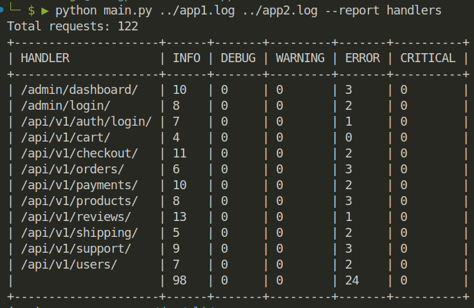

# CLI для анализа логов.
***
### Версии используемых библиотек.
> - python 3.10.12
> - pytest 7.4.4
> - pytest-cov 6.1.1
> - pytest-mock 3.14.0
***
### Запуск приложения.
`python3 main.py <path_to_log> <path_to_log_2> --report handlers`

В качестве обработчика используется `handlers` после `--report`, для использования другой формы отчета необходимо дописать в файле `constants.py` в переменную `REPORTS` ключевое слово которое будет указываться после `--report`, и его же прописать в `match-case` в файле `main.py` в функцию `main` по примеру:
`case ["handlers"]:`
`default_handler(result, HEADERS)`

***
### Пример вывода в консоль.

***